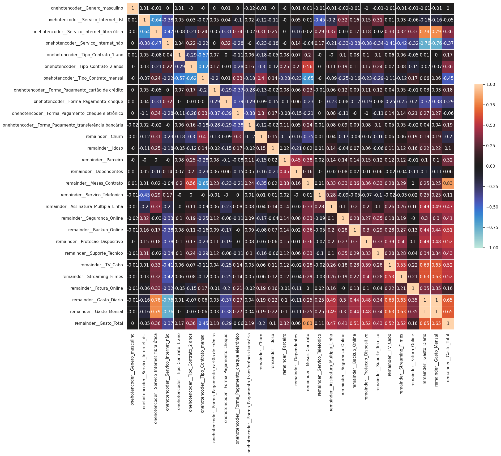
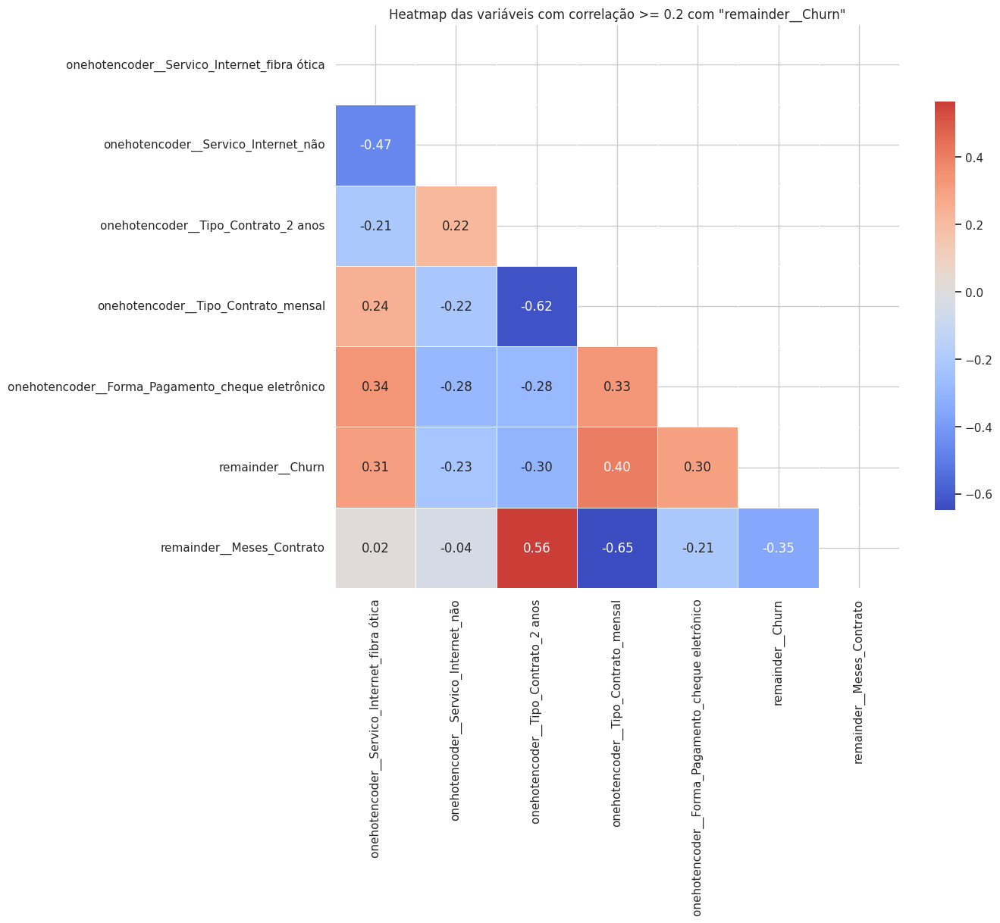
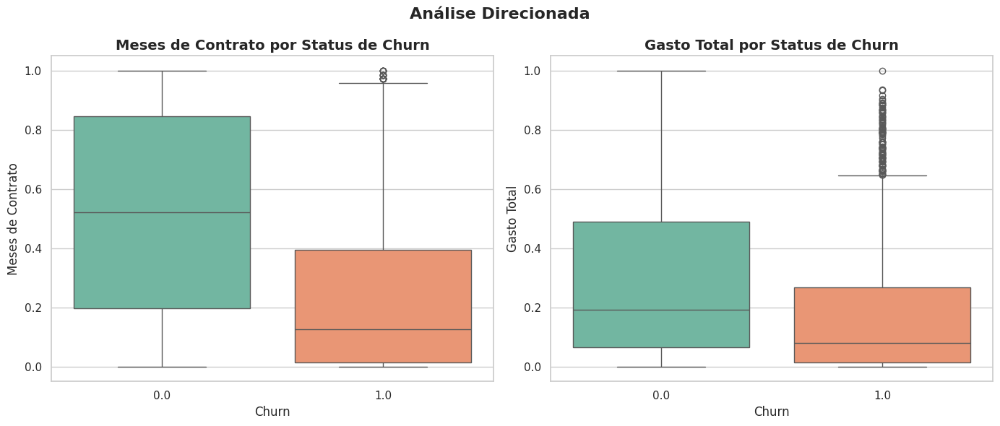

# Challenge ONE Data Science: Telecom X - Análise de Evasão de Clientes - Parte 2

[](https://www.python.org/)
[](https://jupyter.org/)
[](https://colab.research.google.com/github/rodrigosergiosilva/challenge-telecom-x-2/blob/main/TelecomX_Parte2_BR.ipynb)
[]()
[](LICENSE)

Seja bem-vindo ao desafio da Telecom X - Análise de Evasão de Clientes - Parte 2!

Este projeto tem como como objetivo analisar a **evasão de clientes (Churn)** da empresa **Telecom X**, identificando padrões e fatores que contribuem para a saída dos usuários. A compreensão desses elementos é crucial para o desenvolvimento de estratégias eficazes de retenção de clientes e para a melhoria contínua dos serviços oferecidos.

Nesta 2º parte foram realizadas as etapas de preparação dos dados, análise exploratória, balanceamento de classes e modelagem preditiva com dois algoritmos distintos.

---

## 🎯 Propósito da Análise

O principal propósito desta análise é investigar e compreender os fatores que levam à evasão de clientes (churn) em uma empresa. A evasão de clientes é um desafio significativo para a maioria dos negócios, pois adquirir novos clientes geralmente custa mais do que reter os existentes. Ao identificar os padrões e as características dos clientes que evadem, a empresa pode desenvolver estratégias de retenção mais eficazes, direcionar recursos de forma otimizada e, em última instância, aumentar a receita e a lucratividade a longo prazo.

Além de entender os motivos por trás da evasão, esta análise visa construir modelos preditivos capazes de identificar proativamente os clientes que estão em risco de churn. Com um modelo preditivo preciso, a empresa pode intervir antes que o cliente decida sair, oferecendo incentivos personalizados, melhorando a qualidade do serviço ou abordando preocupações específicas. Portanto, o objetivo final é não apenas explicar o churn, mas também prever sua ocorrência para permitir ações preventivas e aumentar a fidelidade do cliente.

---

## 🗂 Estrutura do Projeto

```
📁 challenge-telecom-x-2/
│
├── 📁 dados/                     # Arquivo CSV com dados de evasão de clientes tratado
│   ├── dados_tratados.csv 
├── 📁 imagens/                   # Gráficos gerados durante a análise
│   ├── analise_direcionada.png
│   ├── matriz_correlacao_completa.png
│   └── matriz_correlacao_variaveis_relevantes.png
├── 📄 LICENSE
├── 📄 README.md                  # Este arquivo
├── 📄 TelecomX_Parte2_BR.ipynb   # Notebook principal com toda a análise
```
---

## 📊 Exemplos de Gráficos e Insights

### 🟦🟥🟩 Matriz de Correlação Completa

A matriz de correlação completa exibe um mapa de calor (heatmap) que visualiza as correlações de Pearson entre todos os pares de variáveis. Cada célula do heatmap representa o coeficiente de correlação entre duas variáveis, onde a cor e o valor numérico indicam a força e a direção da relação: cores quentes (próximas ao vermelho) representam correlações positivas, cores frias (próximas ao azul) representam correlações negativas, e cores neutras (próximas ao branco/cinza) indicam baixa ou nenhuma correlação. 

Essa visualização é fundamental para identificar rapidamente quais variáveis estão mais fortemente relacionadas entre si, incluindo suas associações com a variável alvo 'remainder__Churn', auxiliando na compreensão da estrutura dos dados e na seleção de características relevantes para a modelagem.



### ✂️ Matriz de Correlação das Variáveis Relevantes

**Uso de limiar na seleção de variáveis relevantes**

Para simplificar a análise, definiu-se um limiar de correlação absoluta em relação à variável alvo — neste caso, “Evasão”.

* Esse limiar representa o valor mínimo necessário para que a correlação seja considerada significativa.
* Por exemplo, ao adotar o valor de 0,3, apenas as variáveis cuja correlação com “Evasão” seja superior a 0,3 (positiva ou negativa) são incluídas na análise.
* Variáveis com correlação inferior a esse ponto de corte tendem a apresentar pouca ou nenhuma influência sobre a variável alvo e, portanto, são desconsideradas nesta visualização.
* Essa filtragem contribui para reduzir a quantidade de variáveis exibidas, deixando o heatmap mais limpo e focado nas relações mais relevantes.

> **Observação:** o valor ideal do limiar depende do contexto da análise, mas, em geral, intervalos entre 0,2 e 0,5 costumam ser bons pontos de partida em estudos exploratórios.



### 🔎 Análise Direcionada

 A Análise Direcionada apresenta dois boxplots que ilustram a relação entre características dos clientes e o status de evasão (Churn). 
 
 - O primeiro boxplot, "Meses de Contrato por Status de Churn", revela que clientes que evadiram (Churn = 1.0) geralmente possuem uma mediana de meses de contrato significativamente menor em comparação com aqueles que não evadiram (Churn = 0.0), indicando que a curta duração do contrato é um fator associado à evasão.
 - O segundo boxplot, "Gasto Total por Status de Churn", mostra que a mediana do gasto total é consideravelmente menor para clientes que evadiram, sugerindo que clientes com menor gasto total têm uma maior propensão a deixar o serviço.



---

## 🤖 Modelagem Preditiva

Nesta etapa, o foco foi selecionar e treinar modelos de aprendizado de máquina capazes de prever a evasão de clientes (churn) com base nos dados preparados. A modelagem preditiva é o cerne da solução para identificar quais clientes têm maior probabilidade de deixar o serviço. A escolha dos modelos é baseada na natureza do problema (classificação binária) e na capacidade de cada algoritmo em lidar com os padrões dos dados.

Foram selecionados dois modelos para esta análise: a **Regressão Logística** e o **Random Forest**. 

- A Regressão Logística é um modelo linear simples e amplamente utilizado para classificação, que estima a probabilidade de um evento ocorrer. 
- O Random Forest, por sua vez, é um modelo de ensemble baseado em árvores de decisão, conhecido por sua robustez e capacidade de capturar relações não lineares nos dados, frequentemente apresentando bom desempenho em problemas de classificação complexos como a previsão de churn. 

> Ambos os modelos foram treinados utilizando os dados de treino balanceados para aprender a relação entre as características dos clientes e o status de evasão.

## ✅ Conclusão

O objetivo deste projeto foi prever a evasão de clientes e identificar os principais fatores associados a esse comportamento. 
Foram realizadas etapas de preparação dos dados, análise exploratória, balanceamento de classes e modelagem preditiva com dois algoritmos distintos

### Análise de Desempenho dos Modelos

Foi avaliado o desempenho dos modelos de Regressão Logística e Random Forest no conjunto de teste usando métricas como Acurácia, ROC AUC, Matriz de Confusão e Classification Report.

**Regressão Logística**: Apresentou uma acurácia de 0.7718 e um ROC AUC de 0.8537. O modelo demonstrou uma capacidade razoável de prever a evasão, mas cometeu um número considerável de Falsos Positivos e Falsos Negativos.

**Random Forest**: Obteve um desempenho superior, com acurácia de 0.8389 e ROC AUC de 0.9199. Este modelo foi mais eficaz em classificar corretamente os clientes e demonstrou um maior poder de discriminação entre as classes de churn e não-churn.

> **Conclusão de Desempenho:** O modelo Random Forest foi o que melhor se ajustou aos dados e demonstrou maior capacidade preditiva para identificar clientes propensos à evasão.

### Principais Fatores de Evasão Identificados

Com base na análise, os principais fatores que impulsionam a evasão de clientes são:

- Curta Duração do Contrato: Clientes com contratos de curto prazo são mais propensos a sair.
- Padrão de Gastos: Clientes com menor gasto total e possivelmente padrões de gasto diário/mensal específicos são mais vulneráveis à evasão.
- Tipo de Contrato: Contratos mensais são um forte indicador de churn, enquanto contratos de 2 anos promovem a retenção.
- Serviço de Internet (Fibra Ótica): Clientes de fibra ótica parecem mais propensos a evadir, o que pode indicar insatisfação com o serviço.
- Forma de Pagamento (Cheque Eletrônico): Esta forma de pagamento está associada a uma maior probabilidade de churn.
- Falta de Serviços Adicionais: Clientes que não utilizam serviços como segurança online e suporte técnico têm maior risco de evasão.

---

## 🚀 Como Executar o Notebook

1. Tenha o **Python 3.10 ou superior** instalado.
2. (Opcional) Crie um ambiente virtual:
   ```bash
   python -m venv venv
   source venv/bin/activate  # No Windows: venv\Scripts\activate
   ```
3. Instale as dependências:
   ```bash
   pip install pandas matplotlib jupyter
   ```
4. Clone este repositório:
   ```bash
   git clone https://github.com/rodrigosergiosilva/challenge-telecom-x-2.git
   cd challenge-telecom-x-2
   ```
5. Execute o Jupyter Notebook:
   ```bash
   jupyter notebook TelecomX_Parte2_BR.ipynb
   ```

Ou acesse diretamente no Google Colab:  
[](https://colab.research.google.com/github/rodrigosergiosilva/challenge-telecom-x-2/blob/main/TelecomX_Parte2_BR.ipynb)

---
## 📄 Licença

Este projeto está licenciado sob os termos da [](LICENSE).  
Sinta-se livre para usar, modificar e distribuir com os devidos créditos.

---

## 📬 Contato

[](https://www.linkedin.com/in/rodrigo-sergio-silva/)

Fique à vontade para abrir uma **issue** ou enviar uma **pull request** com sugestões ou melhorias! 😄
